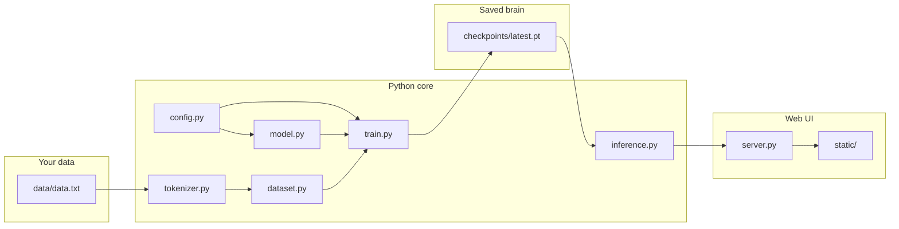
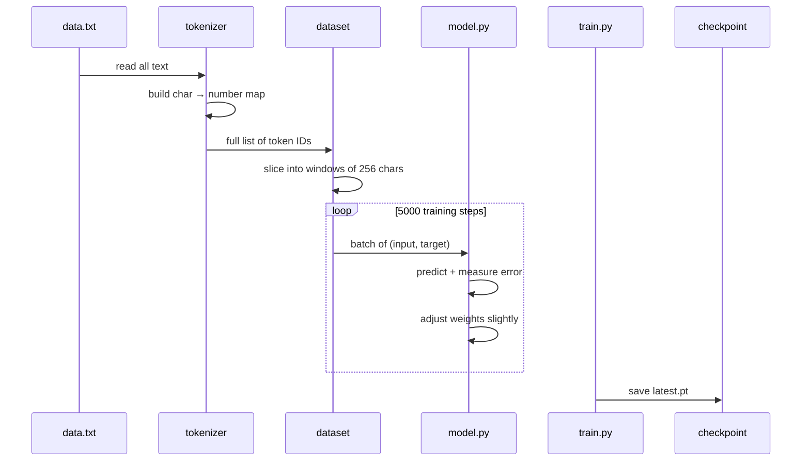
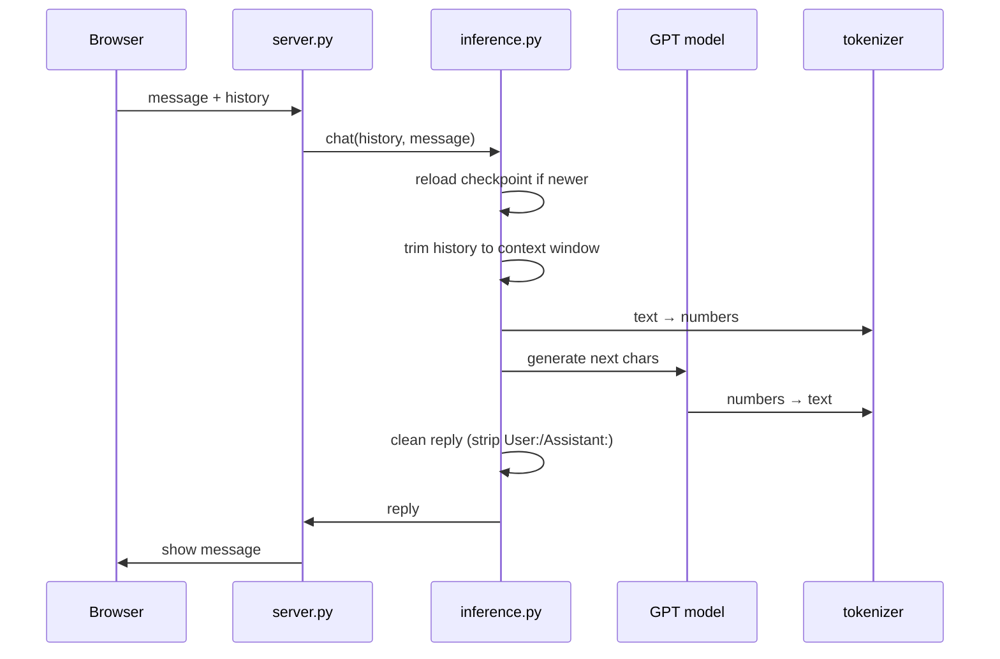
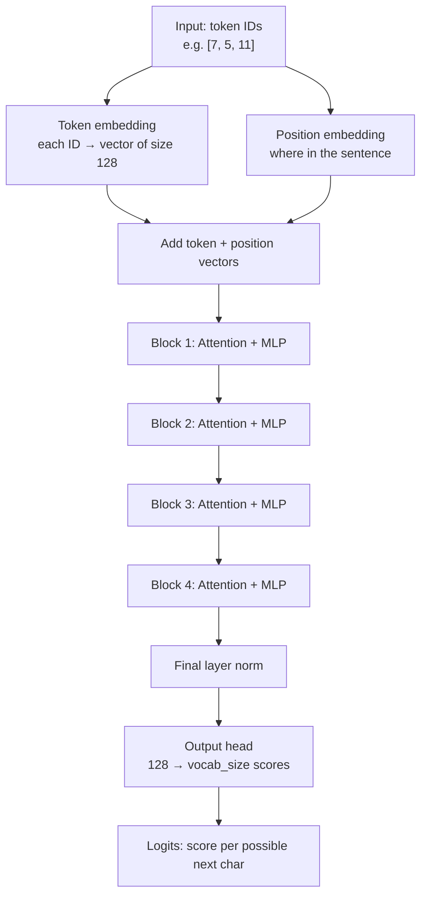
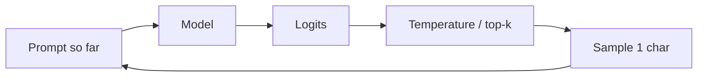
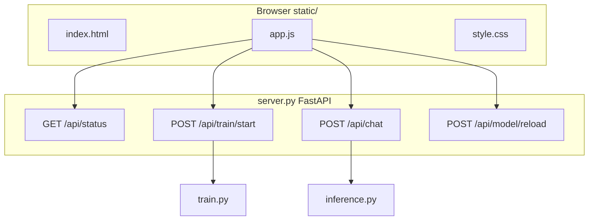

# Mini LLM — Architecture Guide

> **Who this is for:** someone with zero ML background who wants to understand what every file does and how the “brain” actually works.

---

## The big idea in one sentence

We teach a small neural network to **guess the next character** by showing it lots of text — then we ask it to keep guessing, one character at a time, to **write new text**.

That’s what ChatGPT does too — just at a much smaller scale.

---

## The whole system (bird’s-eye view)



**Two modes:**

| Mode | What happens |
|------|----------------|
| **Train** | Read text → learn patterns → save weights to disk |
| **Chat** | Load weights → read your message → generate a reply character by character |

---

## Project file map

Think of the project like a kitchen:

| File | Role | Plain English |
|------|------|----------------|
| **`config.py`** | Recipe card | All the knobs: model size, learning speed, file paths. Does not run anything. |
| **`tokenizer.py`** | Translator | Turns letters into numbers (`"hi"` → `[7, 8]`) and back. |
| **`dataset.py`** | Slicer | Cuts the long number list into bite-sized training chunks. |
| **`model.py`** | The brain | The transformer network that predicts the next character. |
| **`train.py`** | Teacher | Runs the learning loop and saves `checkpoints/latest.pt`. |
| **`inference.py`** | Speaker | Loads the saved brain and generates text / chat replies. |
| **`generate.py`** | CLI demo | Terminal-only text generation. |
| **`server.py`** | Web host | API + training/chat endpoints for the browser UI. |
| **`static/`** | Frontend | Minimal HTML/CSS/JS chat page. |
| **`data/data.txt`** | Textbook | Everything the model learns from. |
| **`scripts/build_training_data.py`** | Data builder | Regenerates or appends dialogue, prose, and code examples. |
| **`scripts/stem_corpus.py`** | STEM data | Science, math, physics, and multi-turn chat blocks. |
| **`scripts/knowledge_corpus.py`** | Knowledge data | Wiki, psychology, stories, jokes, geography, and life Q&A. |
| **`scripts/add_data.py`** | Data CLI | Append text, dialogue, wiki, stem, or knowledge to `data.txt`. |
| **`checkpoints/latest.pt`** | Saved brain | Weights + vocab after training (created by `train.py`). |

---

## Training pipeline (step by step)



### Visual: one training example

Your text as numbers (simplified):

```
[h, e, l, l, o,  , w, o, r, l, d]
[7, 5, 11, 11, 14, 0, 22, 14, 17, 11, 3]
```

With `block_size = 256`, one sample looks like:

```
INPUT  (x):  char₀  char₁  char₂  ...  char₂₅₅
TARGET (y):  char₁  char₂  char₃  ...  char₂₅₆
             ↑ each target is "the next character"
```

The model’s job: at every position, **predict the next character**.

---

## Chat pipeline (after training)



Prompt format (matches training data):

```
User: Hello!
Assistant: 
         ↑ model continues writing here (note the space after the colon)
```

### What `inference.py` does for chat (inference-only — does not affect training)

| Step | What it does |
|------|----------------|
| **Auto-reload** | If `latest.pt` was updated by training, load the newer weights before replying. |
| **History trim** | Keeps only the last 1–2 turns and fits them in the 256-character context window. |
| **Reply cleanup** | Strips stray `User:` / `Assistant:` labels and cuts off when the model starts a new turn. |
| **Chat sampling** | Uses lower temperature/shorter replies than CLI `generate.py` (see `GenerateConfig` in `config.py`). |

The model sees your **exact words** — no prompt rewriting or canned answer routing. Better replies come from **training data and weights**, not hidden if/else rules at chat time.

### Chat “memory” — what to expect

The browser sends **conversation history** each turn, but the model only **sees ~256 characters** at once (`block_size`). That is roughly one short exchange.

| ✅ Can | ❌ Cannot |
|--------|----------|
| Remember the last line or two in the same session | Long multi-turn reasoning |
| Answer well when the prompt matches training format | Always understand corrections like a human |
| Improve as `latest.pt` updates during training | Learn permanently from chat (only training changes weights) |

More multi-turn examples in `data.txt` + longer training help; bigger `block_size` needs a retrain from scratch or careful resize.

---

## Inside `model.py` — how the brain works

### High-level stack

```
Token IDs  →  Embeddings  →  Transformer blocks (×4)  →  Logits  →  Pick next char
  [7,5,11]      vectors         attention + MLP            scores      sample
```



Our config (`config.py`):

| Setting | Value | Meaning |
|---------|-------|---------|
| `d_model` | 128 | Each character position becomes a list of 128 numbers (a **vector**) |
| `n_layers` | 4 | Four transformer blocks stacked |
| `n_heads` | 4 | Four parallel “focus patterns” inside attention |
| `block_size` | 256 | Model sees up to 256 characters at once |
| `vocab_size` | ~87 | How many unique characters exist in your data (grows when you append new text) |

Total parameters: **~837,000** — tiny compared to ChatGPT’s billions.

---

## The math (explained simply)

You don’t need to derive these — just understand *what* each piece means.

### 1. Embeddings — “give each character a fingerprint”

Each character ID gets a vector (a list of numbers):

```
' h '  →  [0.2, -0.5, 0.1, ... ]   (128 numbers)
' e '  →  [0.8,  0.3, -0.2, ... ]
```

**Position embedding** adds “where am I in the sentence?” so the model knows order.

```
final input at position t = token_vector[t] + position_vector[t]
```

---

### 2. Attention — “look at previous characters and decide what matters”

For each character, the model asks: *which earlier characters should I pay attention to?*

Three vectors per position:

| Symbol | Name | Intuition |
|--------|------|-----------|
| **Q** | Query | “What am I looking for?” |
| **K** | Key | “What do I offer?” |
| **V** | Value | “What information do I carry?” |

**Attention score** between position *i* and *j*:

```
score(i, j) = (Qᵢ · Kⱼ) / √d
```

- **Dot product** `Q · K` — if vectors align, score is high → “relevant!”
- **Divide by √d** — keeps numbers stable ( `d` = head size, here 32 )

**Causal mask:** the model may **only look backward**, never at future characters (otherwise cheating during training).

```
Allowed attention pattern (✓ = can look, ✗ = blocked):

        t1  t2  t3  t4
   t1    ✓   ✗   ✗   ✗
   t2    ✓   ✓   ✗   ✗
   t3    ✓   ✓   ✓   ✗
   t4    ✓   ✓   ✓   ✓
```

Turn scores into weights with **softmax** (forces them to sum to 1 — a probability distribution):

```
weight(j) = exp(score_j) / Σ exp(score_k)
```

**Output** at each position = weighted sum of all **V** vectors:

```
output_i = Σⱼ weight(i,j) × Vⱼ
```

**Multi-head (4 heads):** run this 4 times in parallel with different learned Q/K/V — like four different “reading strategies.”

---

### 3. MLP — “think locally after looking around”

After attention, a small feed-forward network processes each position:

```
MLP(x) = Linear₂( GELU( Linear₁(x) ) )
```

- Expands 128 → 512 → back to 128
- **GELU** — a smooth on/off switch (non-linearity) so the network can learn curves, not just straight lines

---

### 4. Residual connections + LayerNorm — “don’t forget; stay stable”

Each block does:

```
x = x + Attention(LayerNorm(x))
x = x + MLP(LayerNorm(x))
```

| Piece | Why |
|-------|-----|
| **`x + ...`** (residual) | Easier to train deep stacks; preserves earlier info |
| **LayerNorm** | Keeps number sizes stable |

---

### 5. Output head — “score every possible next character”

Final vector (128 numbers) → linear layer → **vocab_size scores** (one per character).

```
logits = W × x_final     shape: [vocab_size]
```

Higher score = model thinks that character is more likely next.

Example (fake numbers):

```
'a' → 0.1
'e' → 2.3   ← highest
'z' → -1.0
```

---

### 6. Loss — “how wrong were we?”

During training we know the **correct** next character. We use **cross-entropy loss**:

```
loss = -log( probability assigned to the correct character )
```

| Model says | Loss |
|------------|------|
| 90% on correct char | low ✅ |
| 1% on correct char | high ❌ |

Training **minimizes loss** by nudging millions of weights (via backprop + AdamW optimizer).

---

### 7. Generation — “keep guessing the next character”

At chat time there is no correct answer — we **sample**:

```
1. Run model on prompt
2. Get logits for last position
3. Divide by temperature (higher = more random)
4. Optionally keep only top_k chars
5. softmax → probabilities
6. randomly pick one character
7. append to prompt, repeat
```



**Temperature:**

| Value | Effect |
|-------|--------|
| Low (0.2) | Safe, repetitive |
| Medium (0.8) | Balanced |
| High (1.5+) | Wild, creative, often nonsense |

---

## What `tokenizer.py` does (with a picture)

Computers don’t read `"hello"`. They read numbers.

```
"hello"  ──encode──►  [7, 5, 11, 11, 14]
[7, 5, 11, 11, 14]  ──decode──►  "hello"
```

Two dictionaries:

| Name | Direction |
|------|-----------|
| `stoi` | **s**tring **to** **i**nt |
| `itos` | **i**nt **to** **s**tring |

We use **character-level** tokens — each letter is one token. Simple to build; real LLMs use subwords (BPE).

---

## What `dataset.py` does

```python
chunk = data[i : i + block_size + 1]   # 257 numbers
x = chunk[:-1]    # first 256 → input
y = chunk[1:]     # shifted by 1 → targets
```

PyTorch `DataLoader` groups `batch_size` (32) samples per training step.

---

## What gets saved in a checkpoint?

`checkpoints/latest.pt` contains:

```
├── model weights     (the learned numbers inside the network)
├── mcfg              (model config snapshot)
├── stoi / itos       (vocab maps — must match training!)
```

If you load the wrong vocab, `'h'` might map to a different number and output becomes gibberish.

---

## Web UI architecture



| Endpoint | Purpose |
|----------|---------|
| `GET /` | Chat page |
| `POST /api/train/start` | Train in background thread |
| `GET /api/train/logs` | Poll training output |
| `POST /api/chat` | Send message, get reply |
| `POST /api/model/reload` | Load fresh checkpoint manually (chat also auto-reloads when `latest.pt` changes) |

### Adding training data safely

Append to **`data/data.txt`** — do **not** edit while training is running (training reads the file once at startup).

```powershell
python scripts/add_data.py stats
python scripts/add_data.py dialogue "Hello" "Hi there!"
python scripts/add_data.py wiki          # encyclopedia-style blocks
python scripts/add_data.py stem          # science, math, physics
python scripts/add_data.py knowledge     # psychology, stories, jokes, life Q&A
python train.py                          # resume from latest.pt (never --fresh unless you mean it)
```

When new characters appear, vocab expands and training continues from the checkpoint. If vocab grows, the optimizer state resets but **weights are kept**.

---

## How to run (quick reference)

```powershell
cd llm-model-py
.venv\Scripts\Activate.ps1
pip install -r requirements.txt

python train.py                              # train (auto-resumes from latest.pt)
python -m uvicorn server:app --host 127.0.0.1 --port 8000   # web UI
```

---

## What this model can and cannot do

| ✅ Can | ❌ Cannot |
|--------|----------|
| Learn patterns in `data.txt` | Reason like a human |
| Mimic dialogue format | Reliable facts |
| Run on a laptop | Match ChatGPT quality |
| Teach you how LLMs work | Understand meaning deeply |

It’s a **learning project** — a real pipeline at toy scale.

---

## Glossary

| Term | Simple definition |
|------|-------------------|
| **Token** | One piece of text (here: one character) |
| **Embedding** | A list of numbers representing a token |
| **Transformer** | Architecture using attention + MLP layers |
| **Logits** | Raw scores before probabilities |
| **Softmax** | Turns scores into probabilities (sum to 1) |
| **Loss** | Number measuring wrongness; training lowers it |
| **Checkpoint** | Saved model on disk |
| **Inference** | Using a trained model to generate text |
| **Batch** | Several examples processed together |
| **Context window** | How many tokens the model sees at once (`block_size`) |

---

## Further reading (optional)

- [Attention Is All You Need](https://arxiv.org/abs/1706.03762) — original transformer paper
- [Karpathy nanoGPT / “Let’s build GPT”](https://github.com/karpathy/nanoGPT) — same ideas, great videos
- [Cursor Composer docs](https://cursor.com/docs/models/cursor-composer-2-5) — unrelated to this repo, but shows where frontier coding models live

---

*Built as a from-scratch mini GPT in Python + PyTorch.*
