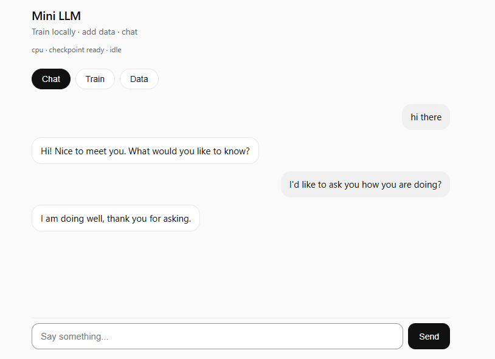

# Mini LLM (Python)

A small GPT-style language model built from scratch in Python and PyTorch. Train it on your own text, chat in the browser, and resume training in short sessions.

~837k parameters. Character-level tokenizer. Runs on CPU or GPU.



## Quick start

```powershell
cd llm-model-py
python -m venv .venv
.venv\Scripts\Activate.ps1
pip install -r requirements.txt
python train.py
```

First checkpoint saves at step 100. On CPU, expect a few minutes per 100 steps.

## Web UI

After at least one checkpoint exists:

```powershell
python -m uvicorn server:app --host 127.0.0.1 --port 8000
```

Open http://127.0.0.1:8000

Tabs: **Chat**, **Train**, **Data**

## Training

| Command | What it does |
|---------|--------------|
| `python train.py` | Resume from `checkpoints/latest.pt` if it exists |
| `python train.py --fresh` | Start over, ignore checkpoints |
| `python train.py --resume-from checkpoints/step_000500.pt` | Resume a specific checkpoint |

Checkpoints save every 100 steps (see `save_every` in `config.py`).

**Tips for CPU training**

- Run one training process at a time
- Prefer an external PowerShell window over the IDE terminal for long runs
- If unstable, set `batch_size: 8` in `config.py`

## Generate from CLI

```powershell
python generate.py
```

Edit the prompt in `config.py` under `GenerateConfig`.

## Add training data

Append dialogue or text to `data/data.txt`, then restart training (it picks up new characters automatically).

```powershell
python scripts/add_data.py stats
python scripts/add_data.py dialogue "Hello" "Hi there!"
python scripts/add_data.py text "Some paragraph to learn from."
python scripts/add_data.py batch
```

Or use the **Data** tab in the web UI.

## Project layout

```
config.py           Settings (model size, learning rate, paths)
tokenizer.py        Text to character IDs
dataset.py          Sliding-window training samples
model.py            GPT-style transformer
train.py            Training loop with resume and checkpoints
inference.py        Load checkpoint and generate replies
generate.py         CLI text generation
server.py           FastAPI web server
checkpoints_util.py Checkpoint save/load helpers
data_util.py        Append data to data.txt
static/             Web UI (HTML, CSS, JS)
scripts/            Data building and debug tools
data/data.txt       Training corpus
ARCHITECTURE.md     How everything works (beginner friendly)
```

## Configuration

Edit `config.py`:

| Setting | Default | Notes |
|---------|---------|-------|
| `block_size` | 256 | Context window (characters) |
| `max_iters` | 5000 | Total training steps |
| `save_every` | 100 | Checkpoint frequency |
| `batch_size` | 16 | Capped on CPU in `train.py` |
| `data_path` | `data/data.txt` | Training text file |

## Debug

```powershell
python scripts/debug.py smoke
python scripts/debug.py list
```

## Requirements

- Python 3.10+
- PyTorch
- FastAPI, Uvicorn, Pydantic (for the web UI)

See `requirements.txt`.

## License

MIT (or your choice). Use and modify freely for learning.
